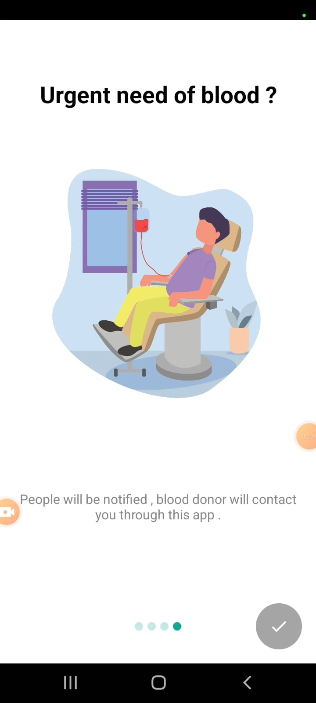

# FitFinder App

## Health Category

Our app is intelligent enough to nudge nearby audience with push notifications , people can wish to hide their profile, cell number etc. and can relay on our in app chat messaging. <bt/>

### Technology/ Stack used 🎓
- Kotlin
- MVVM
- XML
- Node js
- Mongodb
- LiveData
- Room 
- Android Studio

## APK :iphone:
[FitFinder Demo Apk link](https://drive.google.com/drive/folders/1ypmzlnDAOL5T7hxM9nB-4hNi7B8zeyxv?usp=sharing)

## Video 

(https://www.youtube.com/watch?v=Y-FDRwO34Fc&feature=youtu.be)

             

### Features

- User module (Authentication with google for now and update his profile)
- Blood needy person upload story as voice note / image /capture 
- Near by person who is doner would be get notify and chat or call with person 
- Chat module 
- History Module 
- Googel map with list of stories uploading by needy persons 
- Notification if person is nearby within some meters 
- Setting Preference 

### Contact 

You can also write to us at smtrz@yahoo.com / developertouseeq@gmail.com

Thanks.

Team HIGHBRYDS
